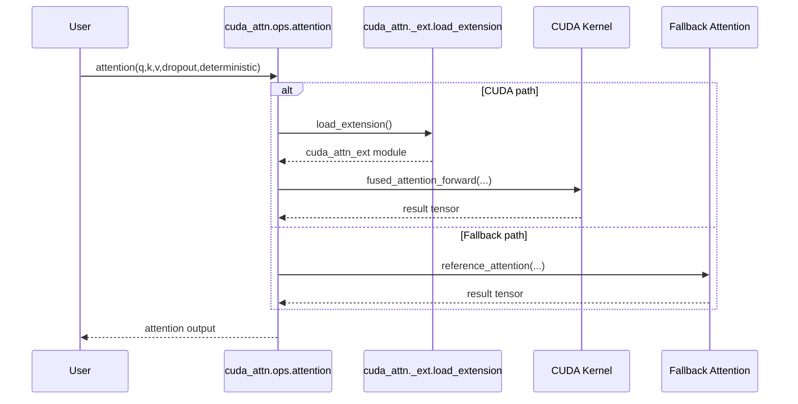

# Architecture Overview

The project delivers fused attention kernels backed by CUDA with a deterministic Python fallback for validation and CPU execution. Build tooling relies on setuptools and torch's extension utilities for consistent compilation against PyTorch.

## Component View

```mermaid
graph TD
    App[User Code] --> Ops[python/cuda_attn/ops.py]
    Ops --> ExtLoader[python/cuda_attn/_ext.py]
    Ops --> Fallback[python/cuda_attn/fallback.py]
    ExtLoader --> CUDAExt[cpp/src/fused_attention*.{cpp,cu}]
    CUDAExt --> Torch[PyTorch Runtime]
    Fallback --> Torch
```

## Call Sequence



## Data Flow

```mermaid
flowchart LR
    QKV[(Q,K,V Inputs)]
    Cast[Optional Cast to float32]
    Scores[Matmul + Softmax]
    Dropout[Dropout (if enabled)]
    Output[Matmul with V]
    Return[(Output Tensor)]

    QKV --> Cast
    Cast --> Scores
    Scores --> Dropout
    Dropout --> Output
    Output --> Return
```

## Future Optimizations

- Integrate shared-memory tiling and warp-level reductions for FlashAttention-style fusion.
- Add backward pass kernels with dropout mask reuse.
- Expand benchmarks to cover mixed-precision variants and varying sequence lengths.

